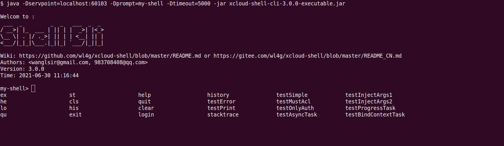
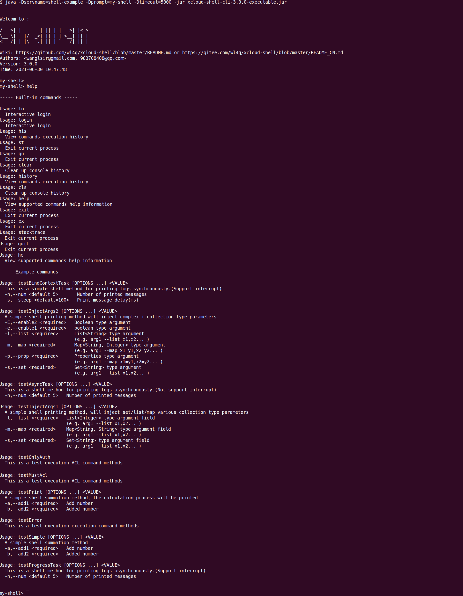
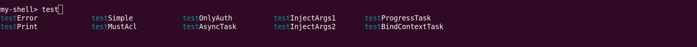
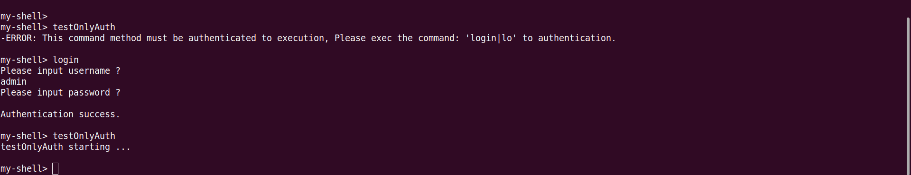
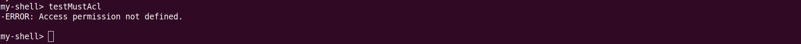
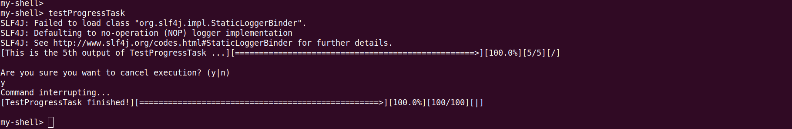
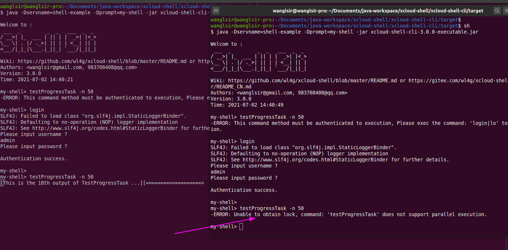

# DoPaaS-Shell
一个基于Java/SpringBoot的命令行框架，让你的应用也拥有类似spark-shell一样的功能。

English version goes [here](README.md).

## 快速开始

### Maven依赖
- Springboot项目只需依赖
```
<!-- https://mvnrepository.com/artifact/com.wl4g/dopaas-shell-springboot -->
<dependency>
  <groupId>com.wl4g</groupId>
  <artifactId>dopaas-shell-springboot</artifactId>
  <version>${latest.version}</version>
</dependency>
<!-- https://mvnrepository.com/artifact/com.wl4g/dopaas-shell-cli -->
<dependency>
  <groupId>com.wl4g</groupId>
  <artifactId>dopaas-shell-cli</artifactId>
  <version>${latest.version}</version>
</dependency>
```

- Java项目只需依赖
```
<!-- https://mvnrepository.com/artifact/com.wl4g/dopaas-shell-core -->
<dependency>
  <groupId>com.wl4g</groupId>
  <artifactId>dopaas-shell-core</artifactId>
  <version>${latest.version}</version>
</dependency>
<!-- https://mvnrepository.com/artifact/com.wl4g/dopaas-shell-cli -->
<dependency>
  <groupId>com.wl4g</groupId>
  <artifactId>dopaas-shell-cli</artifactId>
  <version>${latest.version}</version>
</dependency>
```

[自定义命令处理类示例](dopaas-shell-example/src/main/java/com/wl4g/shell/example/console/ExampleConsole.java)

## 源码编译(若需二次开发)
```
cd dopaas-shell
mvn clean install -DskipTests -T 2C
```

## 启动 CLI

### 方式一
指定服务的端口，然后以客户端运行（适用于客户端模式，通常临时用于连接应用服务使用）：

```
java -Dservpoint=127.0.0.1:60103 -Dprompt=my-shell -Dtimeout=5000 -jar dopaas-shell-cli-${version}-executable.jar
```

在上面的命令中 -Dservpoint 表示要连接的服务侦听地址和端口。

### 方式二
指定服务的名称，然后直接作为客户端运行（适用于本地模式，通常作为应用服务的内置控制台使用）。

```
java -Dservname=shell-example -Dprompt=my-shell -Dtimeout=5000 -jar dopaas-shell-cli-${version}-executable.jar
```

上面的命令中 `-Dservname` 表示服务端应用名称(springboot应用默认使用`spring.application.name`), 它会依据servname在本地自动查
找服务端口建立连接（注意大小写）.也可使用 [方式一](#方式一) 以-Dservpoint 来显示指定服务端点，其中使用 `-Dprompt` 来设置shell
控制台的命令行提示符, `-Dtimeout` 指定等待结果返回超时时间(默认:180_000ms), 还可使用 `-Dxdebug` 打印调试信息。


## 特性  
> 在测试示例命令之前，您必须先运行 example 服务端：[com.wl4g.ShellExample](dopaas-shell-example/src/main/java/com/wl4g/ShellExample.java)   

##### 1. 使用serverpoint连(与servname方式选其一)  
  

##### 2. help帮助  


##### 3. 支持常用快捷键如：Tab自动补全、Ctrl+A光标跳至行首、Ctrl+E光标跳至行尾、Ctrl+C退出控制台(遵循GNU)  


##### 4. 支持认证保护  
  

##### 5. 支持ACL访问控制  
  

##### 6. 支持实时进度显示与强制中断  


##### 7. 支持并发控制锁 (源码参考: [ShellMethod#lock()](dopaas-shell-common/src/main/java/com/wl4g/shell/common/annotation/ShellMethod.java))  



## 内置命令
|long-opt|short-opt|说明|
|-|-|-|
|clear|cls|清理控制台|
|exit/quit|ex/qu|退出控制台|
|history|his|查看历史命令（默认保存到：$USER_HOME/.wl4g/shell/history）|
|stacktrace|st|查看上一次异常的堆栈信息|
|help|he|查看使用帮助|
|login|lo|请求执行登录(如, 当springboot服务端spring.shell.dopaas.shell.acl.enabled=true时所有命令执行必须登录, 否则无需登录)|
